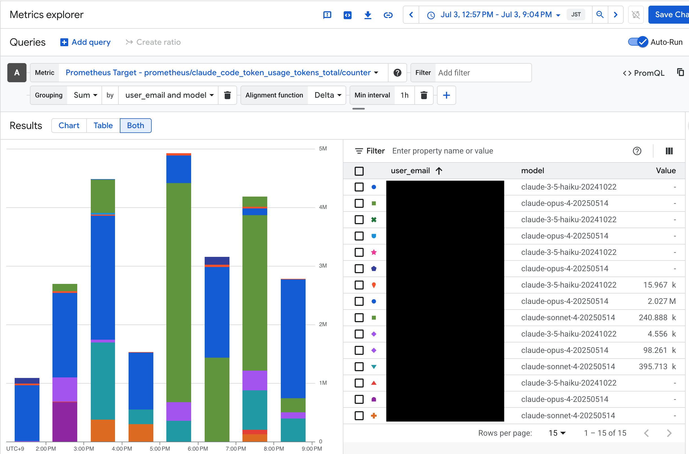

# Claude Code OpenTelemetry Collector for Google Cloud

This project provides a ready-to-deploy OpenTelemetry Collector setup for forwarding [Claude Code telemetry data](https://docs.anthropic.com/en/docs/claude-code/monitoring-usage) to Google Cloud Monitoring and Logging services via Cloud Run.

## Overview

This solution enables you to:
- Collect OpenTelemetry metrics and logs from Claude Code running on your local machine
- Forward telemetry data to Google Cloud Monitoring and Logging via a Cloud Run service
- Secure the collector endpoint with Bearer token authentication
- Monitor Claude Code usage and performance metrics in Google Cloud Console

<div align="center">

</div>

## Prerequisites

- Google Cloud SDK installed and configured
- A Google Cloud project with billing enabled

## Quick Start

1. **Run the setup script** (one-time setup):
   ```bash
   ./setup.sh
   ```

2. **Deploy to Cloud Run**:
   ```bash
   gcloud builds submit --config=cloudbuild.yaml --substitutions=_PROJECT_ID="${PROJECT_ID}"
   ```

3. **Configure Claude Code** with the service URL and Bearer token from the setup output. Add the following to `.claude/settings.json`:
   ```json
   {
      "env": {
         "CLAUDE_CODE_ENABLE_TELEMETRY": "true",
         "OTEL_METRICS_EXPORTER": "otlp",
         "OTEL_LOGS_EXPORTER": "otlp",
         "OTEL_EXPORTER_OTLP_ENDPOINT": "<Cloud Run URL>",
         "OTEL_EXPORTER_OTLP_HEADERS": "Authorization=Bearer <token>",
         "OTEL_EXPORTER_OTLP_PROTOCOL": "http/protobuf",
         "OTEL_RESOURCE_ATTRIBUTES": "location=asia-northeast1"
      }
   }
   ```

   > **Note:** The `location` attribute can be set to any region (e.g., `us-central1`, `europe-west1`), but it must be specified. If omitted, the Google Cloud exporter will reject log data.
